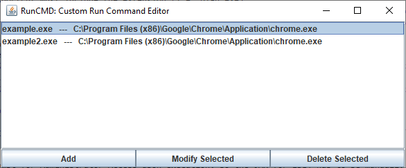
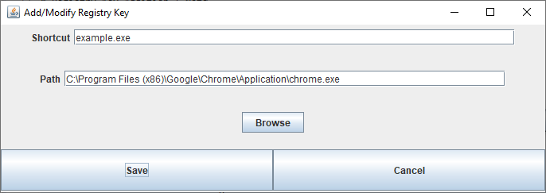
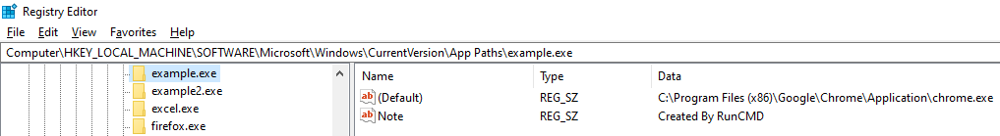

RunCMD

# Purpose
This tool allows the user to more easily create and manage custom run commands, primarily for launching applications that don't have them naturally.

# Usage
* The IDE or JAR has to be run as administrator to have sufficient privileges to modify the registry.  
* When adding a command, the shortcut must include the extension (i.e. blah.exe)
    * When launching (i.e. navigating to Windows Run Prompt), any shortcut using ".exe" does not require the extension.
    * However, other extensions (ex: .bat/.cmd/.msi/etc.) do require the extension be included when adding & launching.

# Screenshots

Launch screen / manage shortcuts:  
  

Adding/modifying a shortcut:  
  
  
Both entries show up in our registry:  
